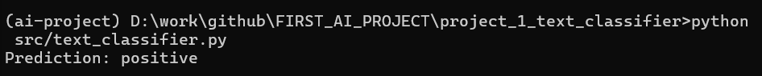
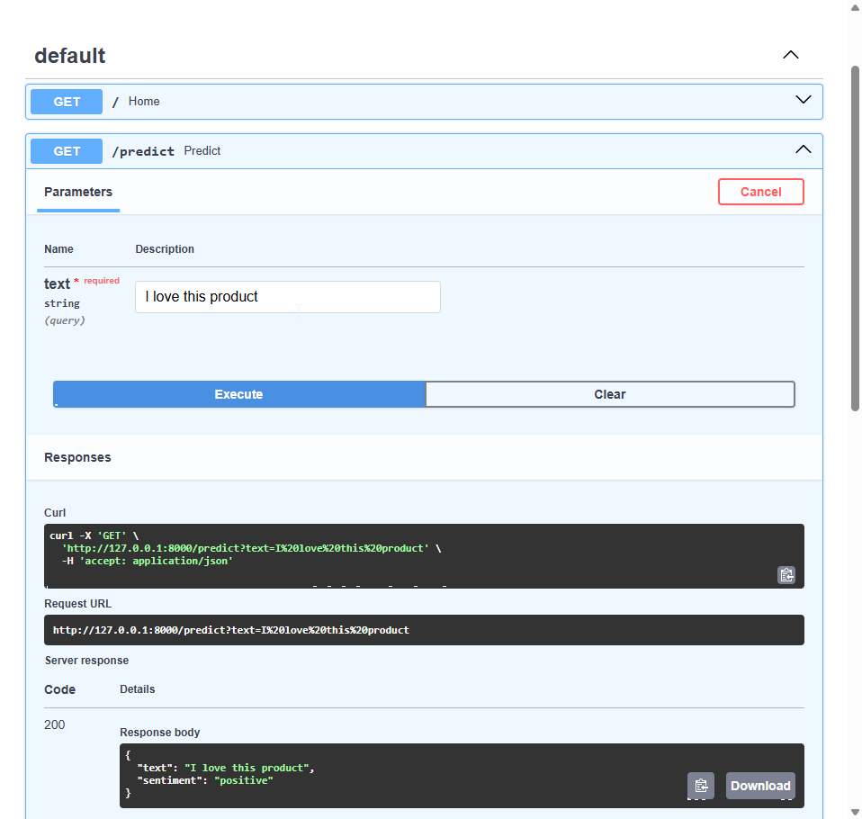
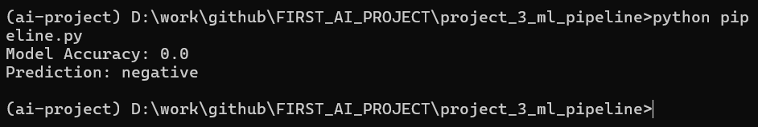
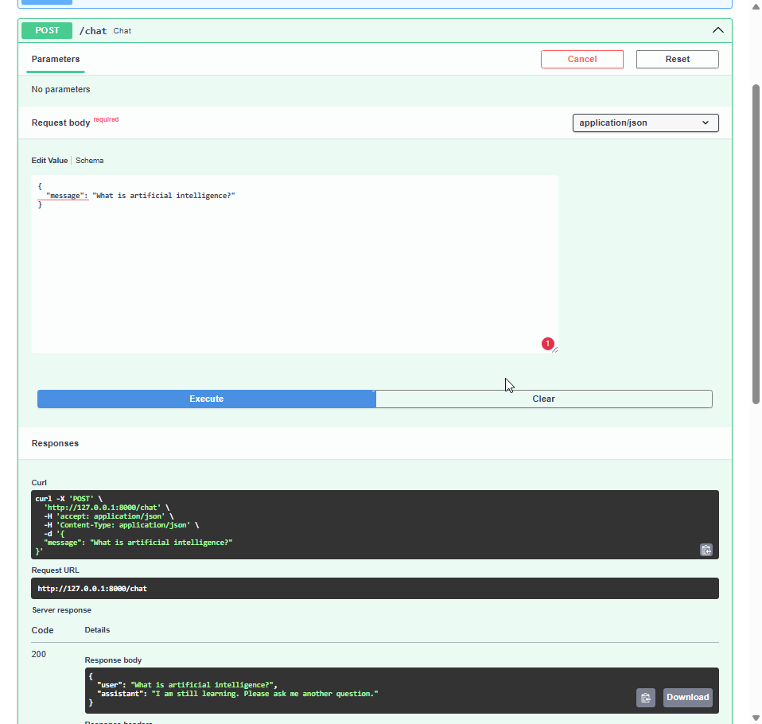

# AI Engineering Portfolio

Welcome to my AI Engineering Portfolio.

I am a Mathematics graduate transitioning into Applied AI Engineering. I combine mathematical problem-solving skills with practical experience building machine learning models, APIs, and AI applications using Python.

## About Me

- 🎓 Master's Degree in Mathematics
- 🤖 Focus: Applied AI Engineering / Machine Learning Engineering
- 🐍 Programming: Python
- 🚀 Interested in building and deploying real-world AI systems

## Technical Skills

- Python
- Machine Learning
- Deep Learning
- Natural Language Processing
- Scikit-learn
- Pandas
- NumPy
- FastAPI
- REST APIs
- Docker
- Git
- Linux

---

## Repository Structure

```text
FIRST_AI_PROJECT
│
├── project_1_text_classifier
│   ├── Model training
│   ├── Text preprocessing
│   └── Classification prediction
│
├── project_2_sentiment_analysis
│   ├── FastAPI application
│   ├── Sentiment prediction endpoint
│   └── REST API service
│
├── project_3_ml_pipeline
│   ├── Data processing
│   ├── Feature engineering
│   ├── Model training
│   └── Evaluation
│
├── project_4_ai_chatbot
│   ├── FastAPI chatbot API
│   ├── User message processing
│   └── AI response generation
│
├── .github
│   └── workflows
│       └── python-check.yml
│
├── README.md
├── PROFILE.md
├── PORTFOLIO.md
├── CONTRIBUTING.md
├── CHANGELOG.md
├── LICENSE
└── .gitignore
```

# Projects Overview

| Project | Description | Technologies |
|---|---|---|
| AI Text Classification | Classifies text into categories using machine learning | Python, Pandas, Scikit-learn |
| Sentiment Analysis API | REST API for sentiment prediction | Python, FastAPI, Uvicorn |
| Machine Learning Pipeline | Complete ML workflow from data preparation to evaluation | Pandas, NumPy, Scikit-learn |
| AI Chatbot Assistant | Chatbot API for processing user messages | Python, FastAPI, NLP |

---

# Project 1: AI Text Classification

## Goal

Build a machine learning model that classifies text into categories.



## Tools

- Python
- Scikit-learn
- Pandas
- NumPy

## Status

Completed first working version.

## How to Run

1. Create and activate the conda environment:

```bash
conda activate ai-project
```

2. Install dependencies:

```bash
pip install -r requirements.txt
```

3. Run the model:

```bash
python text_classifier.py
```

---

# Project 2: Sentiment Analysis API

## Overview

A simple REST API that analyzes text sentiment.




## Features

- FastAPI web service
- Text prediction endpoint
- JSON response format
- Ready for future machine learning model integration

## Technologies

- Python
- FastAPI
- Uvicorn
- Machine Learning

## API Example

### Endpoint

```text
GET /predict?text=I%20love%20this%20product
```

### Explanation

- `GET` → HTTP request method
- `/predict` → API endpoint for sentiment prediction
- `text=` → input text sent to the AI system
- `%20` → represents a space in a URL

### Example Input

```text
I love this product
```

The API receives the text, analyzes it, and returns the sentiment prediction.

### Response

```json
{
  "text": "I love this product",
  "sentiment": "positive"
}
```

---

# Project 3: Machine Learning Pipeline

## Goal

Build a complete machine learning workflow from data preparation to model evaluation.




## Pipeline Steps

1. Data loading
2. Data cleaning
3. Feature engineering
4. Model training
5. Model evaluation
6. Prediction

## Technologies

- Python
- Pandas
- NumPy
- Scikit-learn

## Status

Completed working pipeline.

---

# Project 4: AI Chatbot Assistant

## Goal

Build a simple AI chatbot API that processes user messages and generates responses.



## Features

- REST API chatbot endpoint
- User message processing
- JSON response format
- FastAPI backend
- Ready for future LLM integration

## Technologies

- Python
- FastAPI
- Uvicorn
- Pydantic
- Natural Language Processing

## API Usage

### Endpoint

```text
POST /chat
```

### Request Example

```json
{
  "message": "hello"
}
```

### Response Example

```json
{
  "user": "hello",
  "assistant": "Hello! How can I help you today?"
}
```

## Future Improvements

- Connect with Large Language Models (LLMs)
- Add conversation memory
- Add a web interface
- Deploy as a cloud service

---

# Skills Demonstrated

- Python Programming
- Machine Learning
- Natural Language Processing
- Data Processing
- Model Training and Evaluation
- REST API Development
- FastAPI Backend Development
- Git and GitHub Workflow

---

# Future Goals

Continue building practical AI applications and developing skills toward an Applied AI Engineer role.

---

# How to Run Projects

## Create Environment

Create the conda environment:

```bash
conda create -n ai-project python=3.13
```

Activate the environment:

```bash
conda activate ai-project
```

---

# Project 1: AI Text Classification

Go to the project folder:

```bash
cd project_1_text_classifier
```

Install dependencies:

```bash
pip install -r requirements.txt
```

Run the project:

```bash
python text_classifier.py
```

---

# Project 2: Sentiment Analysis API

Go to the project folder:

```bash
cd project_2_sentiment_analysis
```

Install dependencies:

```bash
pip install -r requirements.txt
```

Start the API server:

```bash
uvicorn app:app --reload
```

Test the API:

```text
GET /predict?text=I%20love%20this%20product
```

Example:

```text
I love this product
```

Expected response:

```json
{
  "text": "I love this product",
  "sentiment": "positive"
}
```

---

# Project 3: Machine Learning Pipeline

Go to the project folder:

```bash
cd project_3_ml_pipeline
```

Install dependencies:

```bash
pip install -r requirements.txt
```

Run the pipeline:

```bash
python pipeline.py
```

---

# Project 4: AI Chatbot Assistant

Go to the project folder:

```bash
cd project_4_ai_chatbot
```

Install dependencies:

```bash
pip install -r requirements.txt
```

Start the chatbot API:

```bash
uvicorn app:app --reload
```

Test the chatbot:

Endpoint:

```text
POST /chat
```

Request:

```json
{
  "message": "hello"
}
```

Response:

```json
{
  "user": "hello",
  "assistant": "Hello! How can I help you today?"
}
```

---

# Docker Support

This repository includes Docker support for running AI projects in isolated containers.

## Supported Projects

- Project 1: AI Text Classification
- Project 2: Sentiment Analysis API

---

# Build and Run with Docker

## Project 1: AI Text Classification

Build Docker image:

```bash
docker build -t text-classifier ./project_1_text_classifier
```

Run the container:

```bash
docker run text-classifier
```

Example output:

```text
Prediction: positive
```

---

## Project 2: Sentiment Analysis API

Build Docker image:

```bash
docker build -t sentiment-analysis ./project_2_sentiment_analysis
```

Run the API container:

```bash
docker run -p 8000:8000 sentiment-analysis
```

Test the API:

```bash
curl "http://localhost:8000/predict?text=I%20love%20this%20product"
```

Example response:

```json
{
  "text": "I love this product",
  "sentiment": "positive"
}
```

---

# Docker Compose

Start services:

```bash
docker compose up -d
```

Check services:

```bash
docker compose ps
```

View logs:

```bash
docker compose logs
```

Stop services:

```bash
docker compose down
```

---

# Docker Environment

- Python 3.13 Slim base image
- Docker containerization
- FastAPI API deployment
- REST API services
- Reproducible development environment
- Docker Compose multi-service orchestration

## Resume

You can view my resume here:

[AI Engineer Resume](resume/Noah_Lin_Cruz_AI_Engineer_Resume.pdf)